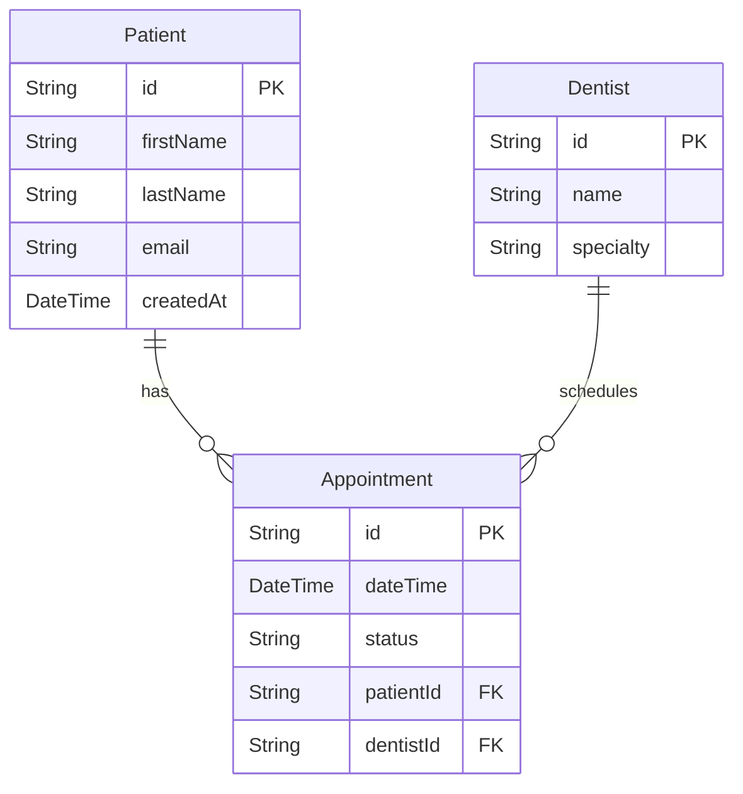

# Vibe Architect - Product Requirements Document

> **Version:** 1.0
> **Date:** January 5, 2026
> **Status:** Draft

---

## 1. Executive Summary

**Vibe Architect** is a local-first development environment that acts as a "Full-Stack Mock App" designer. Unlike tools that only generate UI code, Vibe Architect allows users to architect the Database, Authentication, and Business Logic alongside the frontend through AI-assisted workflows.

The tool visualizes the application locally during the design phase and exports a **production-ready scaffolding package** containing both the code and step-by-step instructions for any AI coding agent to finish the build.

### Core Philosophy

> "The missing design process between your idea and your codebase"

Vibe Architect separates *what to build* from *how to build it*, creating a handoff package that any AI agent (Cursor, Windsurf, Claude Code, etc.) can execute.

---

## 2. Core Value Proposition

| Value                            | Description                                                                                              |
| -------------------------------- | -------------------------------------------------------------------------------------------------------- |
| **Visual Prototyping**     | Users see UI components running live as they design them (The "Mock App" experience)                     |
| **Backend Architecture**   | Automatically generates `schema.prisma` (Database) and `validators.ts` (Zod schemas) to match the UI |
| **Agent-Agnostic Handoff** | Export is a configured Next.js repository with a `docs/prompts/` folder for any AI agent               |
| **File-Based Workflow**    | No database for the tool itself — everything is files that can be version controlled                    |

---

## 3. The "Opinionated" Golden Stack (Export Artifact)

The exported project enforces this production stack:

| Layer                    | Technology                   |
| ------------------------ | ---------------------------- |
| **Framework**      | Next.js 15 (App Router)      |
| **Language**       | TypeScript                   |
| **Database**       | PostgreSQL (with Prisma ORM) |
| **Authentication** | Clerk                        |
| **Validation**     | Zod                          |
| **Styling**        | Tailwind CSS v4 + shadcn/ui  |

---

## 4. Technical Architecture (The Tool Itself)

### 4.1 Tech Stack

| Category                | Technology                             |
| ----------------------- | -------------------------------------- |
| **Build Tool**    | Vite                                   |
| **UI Library**    | React 18                               |
| **Language**      | TypeScript                             |
| **Styling**       | Tailwind CSS v4                        |
| **UI Components** | shadcn/ui (Radix primitives)           |
| **Routing**       | React Router DOM                       |
| **Icons**         | Lucide React                           |
| **Fonts**         | DM Sans + IBM Plex Mono                |
| **State**         | File-based (no state library)          |
| **Persistence**   | File system (via `import.meta.glob`) |
| **Diagrams**      | Mermaid.js                             |

### 4.2 Key Architectural Decisions

1. **No AI SDK Integration** — The tool is "dumb" but "aware." It creates prompt files; the user runs them in their AI agent of choice.
2. **File-Based State** — State is derived from file existence. No IndexedDB, no database.
3. **Build-Time Loading** — Uses Vite's `import.meta.glob` to load markdown/JSON/TypeScript files.
4. **Props-Based Components** — All exportable components receive data via props (never import data directly).
5. **Iframe Preview Isolation** — Screen designs are previewed in iframes for CSS/theme isolation.

---

## 5. User Interface

The application has **4 main tabs** (no chat interface):

### Tab 1: Plan

- Renders `product/product-overview.md` and `product/product-roadmap.md`
- Shows high-level vision, problems solved, and feature list
- Displays section breakdown with completion status

### Tab 2: Data

- Renders `prisma/schema.prisma` as a **Mermaid.js ERD diagram**
- Shows entity relationships visually
- Displays `lib/validators.ts` (Zod schemas)
- Lists all data models with their fields and types

### Tab 3: Designs

- Renders React components from `src/sections/*/` live in an iframe
- Shows design tokens (colors, typography)
- Displays App Shell (sidebar, navigation)
- Provides device size presets (mobile/tablet/desktop)

### Tab 4: Export

- One-click export to ZIP file
- Shows export contents preview
- Validates completeness before export

---

## 6. Project Structure (Vibe Architect Tool)

```
vibe-architect/
├── index.html
├── package.json
├── vite.config.ts
├── tsconfig.json
│
├── public/
│   └── favicon.svg
│
├── src/
│   ├── main.tsx                      # Entry point
│   ├── index.css                     # Tailwind + design tokens
│   │
│   ├── lib/
│   │   ├── router.tsx                # React Router config
│   │   ├── utils.ts                  # cn() helper
│   │   ├── product-loader.ts         # Loads product/*.md
│   │   ├── schema-loader.ts          # Loads/parses schema.prisma
│   │   ├── section-loader.ts         # Loads section artifacts
│   │   ├── shell-loader.ts           # Loads shell components
│   │   ├── mermaid-generator.ts      # Converts Prisma to Mermaid ERD
│   │   └── export-generator.ts       # Generates ZIP export
│   │
│   ├── types/
│   │   ├── product.ts                # ProductData, Roadmap, etc.
│   │   ├── schema.ts                 # PrismaModel, Field, Relation
│   │   └── section.ts                # SectionData, ParsedSpec
│   │
│   ├── components/
│   │   ├── ui/                       # shadcn/ui components
│   │   ├── layout/
│   │   │   ├── AppLayout.tsx         # Main layout wrapper
│   │   │   ├── TabNav.tsx            # 4-tab navigation
│   │   │   └── ThemeToggle.tsx
│   │   ├── plan/
│   │   │   ├── OverviewCard.tsx
│   │   │   └── RoadmapTimeline.tsx
│   │   ├── data/
│   │   │   ├── MermaidDiagram.tsx
│   │   │   ├── SchemaViewer.tsx
│   │   │   └── ValidatorViewer.tsx
│   │   ├── designs/
│   │   │   ├── ComponentPreview.tsx
│   │   │   ├── ShellPreview.tsx
│   │   │   └── DeviceSizeToggle.tsx
│   │   └── export/
│   │       ├── ExportPreview.tsx
│   │       └── ExportButton.tsx
│   │
│   ├── pages/                        # Route-level pages for the 4 tabs
│   │   ├── PlanPage.tsx
│   │   ├── DataPage.tsx
│   │   ├── DesignsPage.tsx
│   │   └── ExportPage.tsx
│   │
│   ├── sections/                     # User's screen designs (live)
│   │   └── [section-id]/
│   │       ├── components/
│   │       │   └── [Component].tsx
│   │       └── [ViewName].tsx        # Preview wrapper
│   │
│   └── shell/                        # User's app shell
│       ├── components/
│       │   ├── AppShell.tsx
│       │   ├── MainNav.tsx
│       │   └── UserMenu.tsx
│       └── ShellPreview.tsx
│
└── product/                          # User's product definition
    ├── product-overview.md
    ├── product-roadmap.md
    ├── data-model/
    │   └── data-model.md
    ├── design-system/
    │   ├── colors.json
    │   └── typography.json
    ├── shell/
    │   └── spec.md
    └── sections/
        └── [section-id]/
            ├── spec.md
            ├── data.json
            ├── types.ts
            └── screenshot.png
```

---

## 7. User Workflow (The 4 Phases)

### Phase 1: Product Vision (Brainstorm)

**User Action:**
Runs AI prompt command (e.g., `/product-vision`) in their agent.

**AI Agent Action:**
Generates `product/product-overview.md` and `product/product-roadmap.md`.

**Tool Visualization:**Plan tab renders the markdown beautifully with:

- Product name and tagline
- Problem statement
- Target users
- Key features list
- Section/milestone breakdown

**Output Files:**

```
product/
├── product-overview.md
└── product-roadmap.md
```

---

### Phase 2: Foundation (Architect)

**User Action:**
Runs AI prompt command (e.g., `/architect-database`) describing data entities.

**AI Agent Action:**

- Generates `prisma/schema.prisma`
- Generates `lib/validators.ts` (Zod schemas)
- Generates `product/data-model/data-model.md`

**Tool Visualization:**Data tab renders:

- Mermaid.js ERD diagram showing all models and relationships
- Collapsible panels for each model's fields
- Zod schema code viewer

**Output Files:**

```
prisma/
└── schema.prisma

lib/
└── validators.ts

product/
└── data-model/
    └── data-model.md
```

---

### Phase 3: Visual Design (The Mock App)

**User Action:**
Runs AI prompt commands to design screens (e.g., `/design-shell`, `/design-screen patients`).

**AI Agent Action:**

- Generates `src/shell/components/*.tsx` (App Shell)
- Generates `src/sections/[id]/components/*.tsx` (Feature components)
- Generates `product/sections/[id]/data.json` (Sample data)
- Generates `product/sections/[id]/types.ts` (TypeScript interfaces)

**Tool Visualization:**Designs tab renders:

- Live iframe preview of components
- Device size toggles (mobile/tablet/desktop)
- Component tree sidebar
- Sample data inspector

**Output Files:**

```
src/
├── shell/
│   └── components/
│       ├── AppShell.tsx
│       ├── MainNav.tsx
│       └── UserMenu.tsx
└── sections/
    └── patients/
        ├── components/
        │   ├── PatientTable.tsx
        │   ├── PatientCard.tsx
        │   └── index.ts
        └── PatientList.tsx

product/
└── sections/
    └── patients/
        ├── spec.md
        ├── data.json
        └── types.ts
```

---

### Phase 4: Export

**User Action:**
Clicks "Export Project" button in the Export tab.

**Tool Action:**

- Bundles all code, schema, docs, and instructions into a ZIP
- Transforms import paths for portability
- Generates instruction files for AI agents

**Output:**
`product-plan.zip` (see Section 8)

---

## 8. Export Artifact Structure

The exported ZIP contains a complete Next.js project scaffold:

```
product-plan/
│
├── README.md                           # Quick start guide
├── package.json                        # Pre-configured dependencies
├── .env.example                        # DATABASE_URL, CLERK_SECRET_KEY
├── .cursorrules                        # AI agent rules (Cursor/Windsurf)
├── tsconfig.json
├── postcss.config.js
├── next.config.ts
│
├── docs/
│   ├── prompts/
│   │   ├── kickoff.md                  # "God Prompt" to start the build
│   │   └── section-prompt.md           # Template for incremental builds
│   │
│   └── instructions/
│       ├── main.md                     # Master plan overview
│       └── incremental/
│           ├── phase_1_foundation.md   # DB, Auth (Clerk), seed data
│           ├── phase_2_shell.md        # App Shell implementation
│           ├── phase_3_patients.md     # Feature A guide
│           └── phase_4_appointments.md # Feature B guide
│
│   # Original product definition (useful for agent handoff)
│   └── product/
│       ├── product-overview.md
│       ├── product-roadmap.md
│       └── sections/
│           └── [section-id]/
│               └── spec.md
│
├── prisma/
│   ├── schema.prisma                   # Complete database schema
│   └── seed.ts                         # Sample data seeder
│
├── lib/
│   ├── validators.ts                   # Zod schemas for all entities
│   └── utils.ts                        # Utility functions
│
├── components/
│   ├── ui/                             # shadcn/ui components
│   ├── shell/                          # App Shell components
│   │   ├── AppShell.tsx
│   │   ├── MainNav.tsx
│   │   └── UserMenu.tsx
│   └── sections/
│       └── [section-id]/
│           ├── [Component].tsx
│           └── index.ts
│
├── app/
│   ├── layout.tsx                      # Root layout (placeholder)
│   ├── page.tsx                        # Home page (placeholder)
│   └── api/
│       └── health/
│           └── route.ts                # Database connection test
│
├── design-system/
│   ├── tokens.css                      # CSS custom properties
│   ├── colors.json
│   └── typography.json
│
└── sample-data/
    └── [section-id]/
        ├── data.json
        └── types.ts
```

---

## 9. AI Prompt Commands

Located in `docs/prompts/` within the user's project. These are agent-agnostic markdown files.

### Available Commands

| Command                      | Purpose                            | Output                                          |
| ---------------------------- | ---------------------------------- | ----------------------------------------------- |
| `/product-vision`          | Define product vision and features | `product-overview.md`, `product-roadmap.md` |
| `/architect-database`      | Design data model                  | `schema.prisma`, `validators.ts`            |
| `/design-tokens`           | Define colors and typography       | `colors.json`, `typography.json`            |
| `/design-shell`            | Create app shell/navigation        | `AppShell.tsx`, `MainNav.tsx`               |
| `/design-screen [section]` | Design a specific screen           | `[Section]/*.tsx`, `data.json`              |
| `/sample-data [section]`   | Generate sample data               | `data.json`, `types.ts`                     |
| `/export-project`          | Generate export package            | `product-plan.zip`                            |

---

## 10. Component Design Principles

### Props-Based Architecture

All exportable components must be **props-based** (never import data directly):

```tsx
// ✅ Correct - Props-based (exportable)
export function PatientTable({
  patients,
  onView,
  onEdit,
  onDelete
}: PatientTableProps) {
  return (/* ... */);
}

// ❌ Wrong - Imports data (not exportable)
import data from './data.json';
export function PatientTable() {
  return (/* uses data directly */);
}
```

### Preview Wrappers

Preview components (not exported) inject sample data:

```tsx
// PatientList.tsx (Preview wrapper - NOT exported)
import data from '/product/sections/patients/data.json';
import { PatientTable } from './components/PatientTable';

export default function PatientListPreview() {
  return (
    <PatientTable
      patients={data.patients}
      onView={(id) => console.log('View:', id)}
      onEdit={(id) => console.log('Edit:', id)}
      onDelete={(id) => console.log('Delete:', id)}
    />
  );
}
```

---

## 11. Mermaid.js Schema Visualization

The Data tab converts `schema.prisma` to a Mermaid ERD:



---

## 12. Success Metrics

| Metric                   | Target                                            |
| ------------------------ | ------------------------------------------------- |
| Time from idea to export | < 30 minutes                                      |
| Export completeness      | 100% (all required files present)                 |
| Agent compatibility      | Works with Cursor, Windsurf, Claude Code, Copilot |
| Zero runtime errors      | Exported components render without errors         |

---

## 13. Future Enhancements (Out of Scope for MVP)

- [ ] Git integration for version control
- [ ] Multiple project support
- [ ] Component library marketplace
- [ ] Collaborative editing
- [ ] Direct database connection for schema introspection
- [ ] Storybook-style component documentation
- [ ] API route generation (Server Actions)

---

## 14. Development Phases

### Phase 1: Foundation (Week 1)

- [ ] Initialize Vite + React + TypeScript project
- [ ] Set up Tailwind CSS v4 + shadcn/ui
- [ ] Implement file loaders (`product-loader.ts`, `schema-loader.ts`)
- [ ] Create base layout and 4-tab navigation

### Phase 2: Plan Tab (Week 1)

- [ ] Markdown rendering for product-overview.md
- [ ] Roadmap timeline component
- [ ] Section completion tracking

### Phase 3: Data Tab (Week 2)

- [ ] Prisma schema parser
- [ ] Mermaid.js ERD generator
- [ ] Zod schema viewer

### Phase 4: Designs Tab (Week 2-3)

- [ ] Iframe preview system
- [ ] Component tree navigation
- [ ] Device size toggles
- [ ] Sample data inspector

### Phase 5: Export Tab (Week 3)

- [ ] ZIP generation with jszip
- [ ] Instruction file templates
- [ ] Path transformation for portability
- [ ] Export validation

### Phase 6: Polish (Week 4)

- [ ] Error handling and empty states
- [ ] Theme toggle (light/dark)
- [ ] Documentation
- [ ] Testing

---

## 15. References

- [Design OS](https://github.com/buildermethods/design-os) - Inspiration and architectural patterns
- [shadcn/ui](https://ui.shadcn.com/) - Component library
- [Mermaid.js](https://mermaid.js.org/) - Diagram generation
- [Prisma](https://www.prisma.io/) - Database ORM
- [Clerk](https://clerk.com/) - Authentication

---

*End of PRD*
