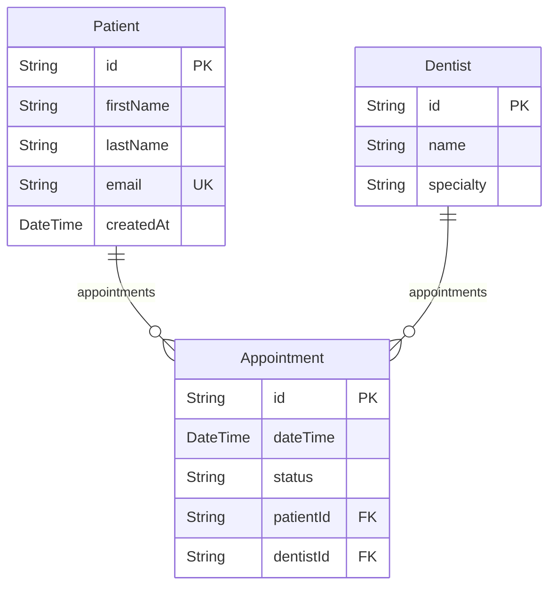

# Phase 4: Data Tab (Schema Visualization) - Detailed Implementation Plan

> **Goal:** Visualize Prisma schema as Mermaid ERD diagram with interactive model exploration  
> **Duration:** 3 days  
> **Outcome:** A complete Data tab that renders Prisma schema as an ERD diagram, displays model details, and shows Zod validators with syntax highlighting

---

## Table of Contents

1. [Prerequisites](#prerequisites)
2. [Step 1: Install Dependencies](#step-1-install-dependencies)
3. [Step 2: Create Mermaid Diagram Component](#step-2-create-mermaid-diagram-component)
4. [Step 3: Create Prisma-to-Mermaid Generator](#step-3-create-prisma-to-mermaid-generator)
5. [Step 4: Create Code Block Component](#step-4-create-code-block-component)
6. [Step 5: Create Model Card Component](#step-5-create-model-card-component)
7. [Step 6: Create Schema Viewer Component](#step-6-create-schema-viewer-component)
8. [Step 7: Create Validator Viewer Component](#step-7-create-validator-viewer-component)
9. [Step 8: Assemble Data Page](#step-8-assemble-data-page)
10. [Step 9: Add Empty States and Loading](#step-9-add-empty-states-and-loading)
11. [Verification Checklist](#verification-checklist)
12. [File Structure Summary](#file-structure-summary)

---

## Prerequisites

Before starting Phase 4, ensure you have:

- [ ] Completed Phase 1 successfully (Vite app with routing and layout)
- [ ] Completed Phase 2 successfully (File loaders and data layer)
- [ ] Completed Phase 3 successfully (Plan tab with markdown rendering)
- [ ] Working Prisma schema loader from Phase 2
- [ ] Sample `prisma/schema.prisma` file created in Phase 2
- [ ] All Phase 3 verification checks passing

**Required from Phase 2:**
- `src/lib/schema-loader.ts` - Loads and parses Prisma schema files
- `src/types/schema.ts` - Type definitions for PrismaModel, PrismaField, PrismaRelation
- `prisma/schema.prisma` - Sample Prisma schema file
- `lib/validators.ts` - Sample Zod validation schemas

**Required from Phase 3:**
- `src/components/shared/EmptyState.tsx` - Empty state component for when no schema exists

---

## Step 1: Install Dependencies

### 1.1 Install Required Packages

```bash
npm install mermaid prism-react-renderer
```

| Package | Purpose |
|---------|---------|
| `mermaid` | JavaScript library for generating diagrams from text definitions |
| `prism-react-renderer` | Syntax highlighting for code blocks (TypeScript, Prisma) |

### 1.2 Why These Packages?

- **mermaid** is the industry standard for generating diagrams from text
  - Supports ERD (Entity Relationship Diagram) syntax
  - Automatically handles layout and positioning
  - Supports theming for light/dark mode
  - SVG output for crisp rendering at any scale

- **prism-react-renderer** provides:
  - React-native syntax highlighting
  - Support for TypeScript and many other languages
  - Customizable themes that match our design system
  - Zero-config setup with sensible defaults

### 1.3 Type Definitions

Both packages include TypeScript definitions. No additional `@types` packages needed.

### 1.4 Verify Installation

```bash
npm ls mermaid prism-react-renderer
```

Expected output:
```
├── mermaid@10.x.x
└── prism-react-renderer@2.x.x
```

---

## Step 2: Create Mermaid Diagram Component

The Mermaid Diagram component is a reusable wrapper that renders Mermaid diagrams with proper initialization and theme support.

### 2.1 Create Directory Structure

```bash
mkdir -p src/components/shared
mkdir -p src/components/data
```

### 2.2 Create `src/components/shared/MermaidDiagram.tsx`

```tsx
import { useEffect, useRef, useState } from "react";
import mermaid from "mermaid";
import { cn } from "@/lib/utils";

interface MermaidDiagramProps {
  chart: string;
  className?: string;
}

// Generate unique IDs for each diagram instance
let diagramId = 0;
const generateId = () => `mermaid-diagram-${++diagramId}`;

export function MermaidDiagram({ chart, className }: MermaidDiagramProps) {
  const containerRef = useRef<HTMLDivElement>(null);
  const [svg, setSvg] = useState<string>("");
  const [error, setError] = useState<string | null>(null);

  useEffect(() => {
    const renderDiagram = async () => {
      if (!chart || !containerRef.current) return;

      try {
        // Initialize mermaid with configuration
        mermaid.initialize({
          startOnLoad: false,
          theme: document.documentElement.classList.contains("dark")
            ? "dark"
            : "default",
          securityLevel: "loose",
          er: {
            diagramPadding: 20,
            layoutDirection: "TB",
            minEntityWidth: 100,
            minEntityHeight: 75,
            entityPadding: 15,
            useMaxWidth: true,
          },
          themeVariables: {
            primaryColor: "#3b82f6",
            primaryTextColor: "#ffffff",
            primaryBorderColor: "#2563eb",
            lineColor: "#64748b",
            secondaryColor: "#f1f5f9",
            tertiaryColor: "#e2e8f0",
          },
        });

        const id = generateId();
        const { svg: renderedSvg } = await mermaid.render(id, chart);
        setSvg(renderedSvg);
        setError(null);
      } catch (err) {
        console.error("Mermaid rendering error:", err);
        setError(err instanceof Error ? err.message : "Failed to render diagram");
        setSvg("");
      }
    };

    renderDiagram();
  }, [chart]);

  // Re-render on theme change
  useEffect(() => {
    const observer = new MutationObserver((mutations) => {
      mutations.forEach((mutation) => {
        if (
          mutation.type === "attributes" &&
          mutation.attributeName === "class"
        ) {
          // Theme changed, re-render
          const event = new Event("themechange");
          window.dispatchEvent(event);
        }
      });
    });

    observer.observe(document.documentElement, {
      attributes: true,
      attributeFilter: ["class"],
    });

    return () => observer.disconnect();
  }, []);

  if (error) {
    return (
      <div
        className={cn(
          "flex items-center justify-center p-8 bg-destructive/10 rounded-lg border border-destructive/20",
          className
        )}
      >
        <div className="text-center">
          <p className="text-destructive font-medium mb-2">Diagram Error</p>
          <p className="text-sm text-muted-foreground">{error}</p>
        </div>
      </div>
    );
  }

  if (!svg) {
    return (
      <div
        className={cn(
          "flex items-center justify-center p-8 bg-muted rounded-lg animate-pulse",
          className
        )}
      >
        <p className="text-muted-foreground">Rendering diagram...</p>
      </div>
    );
  }

  return (
    <div
      ref={containerRef}
      className={cn(
        "mermaid-container overflow-auto bg-background rounded-lg border p-4",
        className
      )}
      dangerouslySetInnerHTML={{ __html: svg }}
    />
  );
}
```

### 2.3 Component Features

| Feature | Description |
|---------|-------------|
| **Auto Theme** | Detects light/dark mode and applies appropriate Mermaid theme |
| **Error Handling** | Gracefully displays errors if diagram fails to render |
| **Loading State** | Shows loading indicator while diagram renders |
| **Theme Reactivity** | Re-renders when theme changes via MutationObserver |
| **Unique IDs** | Generates unique IDs to prevent conflicts with multiple diagrams |
| **ERD Optimized** | Configuration tuned for Entity Relationship Diagrams |

### 2.4 Add to Shared Components Index

Update `src/components/shared/index.ts`:

```typescript
export { MarkdownRenderer } from "./MarkdownRenderer";
export { EmptyState } from "./EmptyState";
export { MermaidDiagram } from "./MermaidDiagram";
```

---

## Step 3: Create Prisma-to-Mermaid Generator

This utility converts the parsed Prisma schema (from Phase 2's schema-loader) into Mermaid ERD syntax.

### 3.1 Create `src/lib/mermaid-generator.ts`

```typescript
import type { PrismaModel, PrismaField, PrismaRelation } from "@/types/schema";

/**
 * Converts Prisma schema models to Mermaid ERD diagram syntax
 */
export function generateMermaidERD(models: PrismaModel[]): string {
  if (!models || models.length === 0) {
    return "";
  }

  const lines: string[] = ["erDiagram"];

  // Generate entity definitions
  for (const model of models) {
    lines.push(`    ${model.name} {`);

    for (const field of model.fields) {
      // Skip relation fields (they're represented as lines)
      if (isRelationField(field)) continue;

      const fieldLine = formatFieldLine(field);
      lines.push(`        ${fieldLine}`);
    }

    lines.push("    }");
  }

  // Generate relationships
  const relationships = extractRelationships(models);
  for (const rel of relationships) {
    lines.push(`    ${rel}`);
  }

  return lines.join("\n");
}

/**
 * Checks if a field is a relation (references another model)
 */
function isRelationField(field: PrismaField): boolean {
  // Relation fields typically have a relation decorator or are arrays of other models
  return field.isRelation === true;
}

/**
 * Formats a single field line for Mermaid ERD
 * Format: Type name PK/FK "comment"
 */
function formatFieldLine(field: PrismaField): string {
  const parts: string[] = [];

  // Map Prisma types to display types
  const displayType = mapPrismaType(field.type);
  parts.push(displayType);

  // Field name
  parts.push(field.name);

  // Key indicators
  const modifiers: string[] = [];
  if (field.isPrimaryKey) modifiers.push("PK");
  if (field.isForeignKey) modifiers.push("FK");
  if (field.isUnique && !field.isPrimaryKey) modifiers.push("UK");

  if (modifiers.length > 0) {
    parts.push(modifiers.join(","));
  }

  return parts.join(" ");
}

/**
 * Maps Prisma types to simplified display types
 */
function mapPrismaType(prismaType: string): string {
  const typeMap: Record<string, string> = {
    String: "String",
    Int: "Int",
    Float: "Float",
    Boolean: "Boolean",
    DateTime: "DateTime",
    Json: "Json",
    BigInt: "BigInt",
    Decimal: "Decimal",
    Bytes: "Bytes",
  };

  // Handle optional types (String?)
  const baseType = prismaType.replace("?", "").replace("[]", "");

  return typeMap[baseType] || baseType;
}

/**
 * Extracts relationships from models and formats them for Mermaid
 */
function extractRelationships(models: PrismaModel[]): string[] {
  const relationships: string[] = [];
  const processedRelations = new Set<string>();

  for (const model of models) {
    if (!model.relations) continue;

    for (const relation of model.relations) {
      // Create a unique key to avoid duplicate relationships
      const relKey = [model.name, relation.relatedModel].sort().join("-");

      if (processedRelations.has(relKey)) continue;
      processedRelations.add(relKey);

      const mermaidRel = formatRelationship(
        model.name,
        relation.relatedModel,
        relation.type,
        relation.name
      );
      relationships.push(mermaidRel);
    }
  }

  return relationships;
}

/**
 * Formats a relationship for Mermaid ERD
 */
function formatRelationship(
  from: string,
  to: string,
  relationType: "one-to-one" | "one-to-many" | "many-to-many",
  relationName?: string
): string {
  let connector: string;

  switch (relationType) {
    case "one-to-one":
      connector = "||--||";
      break;
    case "one-to-many":
      connector = "||--o{";
      break;
    case "many-to-many":
      connector = "}o--o{";
      break;
    default:
      connector = "||--o{"; // Default to one-to-many
  }

  const label = relationName ? `"${relationName}"` : '""';
  return `${from} ${connector} ${to} : ${label}`;
}

/**
 * Relationship mapping reference:
 *
 * | Prisma                     | Mermaid    | Description        |
 * |---------------------------|------------|-------------------|
 * | One-to-One (1:1)          | ||--||     | Exactly one each   |
 * | One-to-Many (1:N)         | ||--o{     | One to zero+       |
 * | Many-to-Many (M:N)        | }o--o{     | Zero+ to zero+     |
 */
```

### 3.2 Generator Output Example

Given this Prisma schema (from Phase 2):

```prisma
model Patient {
  id          String   @id @default(cuid())
  firstName   String
  lastName    String
  email       String   @unique
  createdAt   DateTime @default(now())
  appointments Appointment[]
}

model Appointment {
  id        String   @id @default(cuid())
  dateTime  DateTime
  status    String
  patientId String
  patient   Patient  @relation(fields: [patientId], references: [id])
  dentistId String
  dentist   Dentist  @relation(fields: [dentistId], references: [id])
}

model Dentist {
  id          String   @id @default(cuid())
  name        String
  specialty   String
  appointments Appointment[]
}
```

The generator produces:



### 3.3 Relationship Type Detection

Add a helper to infer relationship types from Prisma schema:

```typescript
/**
 * Infers the relationship type from Prisma field definitions
 */
export function inferRelationType(
  field: PrismaField,
  relatedField?: PrismaField
): "one-to-one" | "one-to-many" | "many-to-many" {
  const isArray = field.type.endsWith("[]");
  const relatedIsArray = relatedField?.type.endsWith("[]") ?? false;

  if (isArray && relatedIsArray) {
    return "many-to-many";
  } else if (isArray || relatedIsArray) {
    return "one-to-many";
  } else {
    return "one-to-one";
  }
}
```

---

## Step 4: Create Code Block Component

The Code Block component provides syntax highlighting for TypeScript, Prisma, and other languages using prism-react-renderer.

### 4.1 Create `src/components/shared/CodeBlock.tsx`

```tsx
import { Highlight, themes } from "prism-react-renderer";
import { useState } from "react";
import { Copy, Check } from "lucide-react";
import { cn } from "@/lib/utils";
import { Button } from "@/components/ui/button";

interface CodeBlockProps {
  code: string;
  language?: string;
  showLineNumbers?: boolean;
  showCopyButton?: boolean;
  className?: string;
  maxHeight?: string;
}

export function CodeBlock({
  code,
  language = "typescript",
  showLineNumbers = true,
  showCopyButton = true,
  className,
  maxHeight = "400px",
}: CodeBlockProps) {
  const [copied, setCopied] = useState(false);

  const handleCopy = async () => {
    await navigator.clipboard.writeText(code);
    setCopied(true);
    setTimeout(() => setCopied(false), 2000);
  };

  // Detect if dark mode
  const isDark = document.documentElement.classList.contains("dark");

  return (
    <div className={cn("relative group rounded-lg overflow-hidden", className)}>
      {/* Copy Button */}
      {showCopyButton && (
        <Button
          variant="ghost"
          size="icon"
          className="absolute top-2 right-2 z-10 opacity-0 group-hover:opacity-100 transition-opacity h-8 w-8 bg-background/80 backdrop-blur-sm"
          onClick={handleCopy}
        >
          {copied ? (
            <Check className="h-4 w-4 text-green-500" />
          ) : (
            <Copy className="h-4 w-4" />
          )}
        </Button>
      )}

      {/* Language Badge */}
      <div className="absolute top-2 left-2 z-10 px-2 py-1 text-xs font-mono bg-background/80 backdrop-blur-sm rounded">
        {language}
      </div>

      {/* Code Highlight */}
      <Highlight
        theme={isDark ? themes.nightOwl : themes.github}
        code={code.trim()}
        language={language as any}
      >
        {({ className: highlightClassName, style, tokens, getLineProps, getTokenProps }) => (
          <pre
            className={cn(
              highlightClassName,
              "p-4 pt-10 overflow-auto text-sm font-mono"
            )}
            style={{
              ...style,
              maxHeight,
              margin: 0,
              backgroundColor: isDark ? "#011627" : "#f6f8fa",
            }}
          >
            {tokens.map((line, lineIndex) => (
              <div
                key={lineIndex}
                {...getLineProps({ line })}
                className="table-row"
              >
                {showLineNumbers && (
                  <span className="table-cell pr-4 text-right select-none opacity-50 text-xs">
                    {lineIndex + 1}
                  </span>
                )}
                <span className="table-cell">
                  {line.map((token, tokenIndex) => (
                    <span key={tokenIndex} {...getTokenProps({ token })} />
                  ))}
                </span>
              </div>
            ))}
          </pre>
        )}
      </Highlight>
    </div>
  );
}
```

### 4.2 Component Features

| Feature | Description |
|---------|-------------|
| **Syntax Highlighting** | Full syntax highlighting via Prism |
| **Theme Aware** | Switches between light/dark themes automatically |
| **Copy to Clipboard** | One-click copy with visual feedback |
| **Line Numbers** | Optional line numbers (default: on) |
| **Language Badge** | Shows the language in the corner |
| **Max Height** | Configurable max height with scrolling |
| **Hover Effects** | Copy button appears on hover |

### 4.3 Supported Languages

`prism-react-renderer` supports many languages out of the box:

| Language | Use Case |
|----------|----------|
| `typescript` | TypeScript/Zod validators |
| `javascript` | JavaScript files |
| `prisma` | Prisma schema (may need extension) |
| `json` | JSON data files |
| `bash` | Terminal commands |
| `sql` | SQL queries |

### 4.4 Add Prisma Language Support (Optional)

For better Prisma syntax highlighting, create a custom language definition:

```typescript
// src/lib/prism-prisma.ts
import { Prism } from "prism-react-renderer";

// Add Prisma language definition
(Prism.languages as any).prisma = {
  comment: /\/\/.*/,
  string: {
    pattern: /"(?:\\.|[^"\\])*"/,
    greedy: true,
  },
  keyword: /\b(?:model|enum|datasource|generator|type)\b/,
  function: /\b(?:@id|@unique|@default|@relation|@map|@updatedAt|@ignore)\b/,
  builtin: /\b(?:String|Int|Boolean|DateTime|Float|Json|BigInt|Decimal|Bytes)\b/,
  operator: /[=?[\]]/,
  punctuation: /[{}(),]/,
};
```

### 4.5 Update Shared Components Index

Update `src/components/shared/index.ts`:

```typescript
export { MarkdownRenderer } from "./MarkdownRenderer";
export { EmptyState } from "./EmptyState";
export { MermaidDiagram } from "./MermaidDiagram";
export { CodeBlock } from "./CodeBlock";
```

---

## Step 5: Create Model Card Component

The Model Card component displays detailed information about a single Prisma model, including its fields and their attributes.

### 5.1 Create `src/components/data/ModelCard.tsx`

```tsx
import { Key, Hash, Link2, Calendar, Type, ToggleLeft } from "lucide-react";
import { cn } from "@/lib/utils";
import { Card, CardContent, CardHeader, CardTitle } from "@/components/ui/card";
import type { PrismaModel, PrismaField } from "@/types/schema";

interface ModelCardProps {
  model: PrismaModel;
  isSelected?: boolean;
  onClick?: () => void;
  className?: string;
}

export function ModelCard({
  model,
  isSelected = false,
  onClick,
  className,
}: ModelCardProps) {
  return (
    <Card
      className={cn(
        "cursor-pointer transition-all hover:border-primary/50",
        isSelected && "border-primary ring-2 ring-primary/20",
        className
      )}
      onClick={onClick}
    >
      <CardHeader className="pb-3">
        <CardTitle className="flex items-center gap-2 text-lg">
          <div className="h-2 w-2 rounded-full bg-primary" />
          {model.name}
        </CardTitle>
      </CardHeader>
      <CardContent>
        <div className="space-y-2">
          {model.fields
            .filter((field) => !field.isRelation)
            .map((field) => (
              <FieldRow key={field.name} field={field} />
            ))}
        </div>

        {/* Relations summary */}
        {model.relations && model.relations.length > 0 && (
          <div className="mt-4 pt-3 border-t">
            <p className="text-xs text-muted-foreground mb-2">Relations</p>
            <div className="flex flex-wrap gap-1">
              {model.relations.map((rel) => (
                <span
                  key={rel.name}
                  className="inline-flex items-center gap-1 px-2 py-1 text-xs bg-muted rounded-full"
                >
                  <Link2 className="h-3 w-3" />
                  {rel.relatedModel}
                </span>
              ))}
            </div>
          </div>
        )}
      </CardContent>
    </Card>
  );
}

interface FieldRowProps {
  field: PrismaField;
}

function FieldRow({ field }: FieldRowProps) {
  return (
    <div className="flex items-center justify-between py-1 text-sm">
      <div className="flex items-center gap-2">
        <FieldIcon field={field} />
        <span className={cn(field.isOptional && "text-muted-foreground")}>
          {field.name}
          {field.isOptional && "?"}
        </span>
      </div>
      <div className="flex items-center gap-2">
        <span className="text-muted-foreground font-mono text-xs">
          {field.type}
        </span>
        <FieldBadges field={field} />
      </div>
    </div>
  );
}

function FieldIcon({ field }: { field: PrismaField }) {
  if (field.isPrimaryKey) {
    return <Key className="h-3.5 w-3.5 text-yellow-500" />;
  }
  if (field.isForeignKey) {
    return <Link2 className="h-3.5 w-3.5 text-blue-500" />;
  }

  // Type-based icons
  switch (field.type.replace("?", "").replace("[]", "")) {
    case "DateTime":
      return <Calendar className="h-3.5 w-3.5 text-muted-foreground" />;
    case "Boolean":
      return <ToggleLeft className="h-3.5 w-3.5 text-muted-foreground" />;
    case "Int":
    case "Float":
    case "Decimal":
    case "BigInt":
      return <Hash className="h-3.5 w-3.5 text-muted-foreground" />;
    default:
      return <Type className="h-3.5 w-3.5 text-muted-foreground" />;
  }
}

function FieldBadges({ field }: { field: PrismaField }) {
  const badges: { label: string; className: string }[] = [];

  if (field.isPrimaryKey) {
    badges.push({
      label: "PK",
      className: "bg-yellow-500/20 text-yellow-700 dark:text-yellow-400",
    });
  }
  if (field.isForeignKey) {
    badges.push({
      label: "FK",
      className: "bg-blue-500/20 text-blue-700 dark:text-blue-400",
    });
  }
  if (field.isUnique && !field.isPrimaryKey) {
    badges.push({
      label: "UQ",
      className: "bg-purple-500/20 text-purple-700 dark:text-purple-400",
    });
  }

  return (
    <div className="flex gap-1">
      {badges.map((badge) => (
        <span
          key={badge.label}
          className={cn(
            "px-1.5 py-0.5 text-[10px] font-medium rounded",
            badge.className
          )}
        >
          {badge.label}
        </span>
      ))}
    </div>
  );
}
```

### 5.2 Component Features

| Feature | Description |
|---------|-------------|
| **Field Icons** | Visual icons based on field type and role |
| **Key Indicators** | PK (Primary Key), FK (Foreign Key), UQ (Unique) badges |
| **Optional Fields** | Visual indication for nullable fields |
| **Relations Summary** | Shows linked models at bottom of card |
| **Selection State** | Visual highlight when selected |
| **Hover Effects** | Interactive feedback on hover |

### 5.3 Field Badge Color Scheme

| Badge | Color | Meaning |
|-------|-------|---------|
| PK | Yellow | Primary Key |
| FK | Blue | Foreign Key (reference) |
| UQ | Purple | Unique constraint |

### 5.4 Create Component Index

Create `src/components/data/index.ts`:

```typescript
export { ModelCard } from "./ModelCard";
```

---

## Step 6: Create Schema Viewer Component

The Schema Viewer combines the ERD diagram with the model list sidebar, providing a complete view of the database schema.

### 6.1 Create `src/components/data/SchemaViewer.tsx`

```tsx
import { useState } from "react";
import { Database, Table2, ZoomIn, ZoomOut, Maximize2 } from "lucide-react";
import { cn } from "@/lib/utils";
import { Button } from "@/components/ui/button";
import { ScrollArea } from "@/components/ui/scroll-area";
import { MermaidDiagram } from "@/components/shared/MermaidDiagram";
import { ModelCard } from "./ModelCard";
import { generateMermaidERD } from "@/lib/mermaid-generator";
import type { PrismaModel } from "@/types/schema";

interface SchemaViewerProps {
  models: PrismaModel[];
  className?: string;
}

export function SchemaViewer({ models, className }: SchemaViewerProps) {
  const [selectedModel, setSelectedModel] = useState<string | null>(null);
  const [zoom, setZoom] = useState(100);

  // Generate Mermaid ERD from models
  const mermaidChart = generateMermaidERD(models);

  const handleZoomIn = () => setZoom((prev) => Math.min(prev + 25, 200));
  const handleZoomOut = () => setZoom((prev) => Math.max(prev - 25, 50));
  const handleZoomReset = () => setZoom(100);

  const selectedModelData = models.find((m) => m.name === selectedModel);

  return (
    <div className={cn("flex h-full", className)}>
      {/* Main ERD Diagram Area */}
      <div className="flex-1 flex flex-col min-w-0">
        {/* Toolbar */}
        <div className="flex items-center justify-between p-3 border-b bg-muted/30">
          <div className="flex items-center gap-2">
            <Database className="h-4 w-4 text-muted-foreground" />
            <span className="text-sm font-medium">
              Entity Relationship Diagram
            </span>
            <span className="text-xs text-muted-foreground">
              ({models.length} models)
            </span>
          </div>

          {/* Zoom Controls */}
          <div className="flex items-center gap-1">
            <Button
              variant="ghost"
              size="icon"
              className="h-8 w-8"
              onClick={handleZoomOut}
              disabled={zoom <= 50}
            >
              <ZoomOut className="h-4 w-4" />
            </Button>
            <span className="text-xs text-muted-foreground w-12 text-center">
              {zoom}%
            </span>
            <Button
              variant="ghost"
              size="icon"
              className="h-8 w-8"
              onClick={handleZoomIn}
              disabled={zoom >= 200}
            >
              <ZoomIn className="h-4 w-4" />
            </Button>
            <Button
              variant="ghost"
              size="icon"
              className="h-8 w-8"
              onClick={handleZoomReset}
            >
              <Maximize2 className="h-4 w-4" />
            </Button>
          </div>
        </div>

        {/* Diagram Container */}
        <div className="flex-1 overflow-auto p-4 bg-muted/10">
          <div
            style={{
              transform: `scale(${zoom / 100})`,
              transformOrigin: "top left",
              transition: "transform 0.2s ease",
            }}
          >
            <MermaidDiagram chart={mermaidChart} />
          </div>
        </div>
      </div>

      {/* Model List Sidebar */}
      <div className="w-80 border-l flex flex-col bg-background">
        <div className="flex items-center gap-2 p-3 border-b">
          <Table2 className="h-4 w-4 text-muted-foreground" />
          <span className="text-sm font-medium">Models</span>
        </div>

        <ScrollArea className="flex-1">
          <div className="p-3 space-y-3">
            {models.map((model) => (
              <ModelCard
                key={model.name}
                model={model}
                isSelected={selectedModel === model.name}
                onClick={() =>
                  setSelectedModel(
                    selectedModel === model.name ? null : model.name
                  )
                }
              />
            ))}
          </div>
        </ScrollArea>

        {/* Selected Model Details */}
        {selectedModelData && (
          <div className="border-t p-3 bg-muted/30">
            <h4 className="text-sm font-medium mb-2">
              {selectedModelData.name} Details
            </h4>
            <div className="text-xs text-muted-foreground space-y-1">
              <p>Fields: {selectedModelData.fields.length}</p>
              <p>Relations: {selectedModelData.relations?.length ?? 0}</p>
              {selectedModelData.fields.find((f) => f.isPrimaryKey) && (
                <p>
                  Primary Key:{" "}
                  {selectedModelData.fields.find((f) => f.isPrimaryKey)?.name}
                </p>
              )}
            </div>
          </div>
        )}
      </div>
    </div>
  );
}
```

### 6.2 Component Features

| Feature | Description |
|---------|-------------|
| **Split Layout** | ERD diagram on left, model list on right |
| **Zoom Controls** | Zoom in/out/reset for diagram navigation |
| **Model Selection** | Click model cards to select and see details |
| **Model Count** | Shows total number of models in header |
| **Scroll Areas** | Scrollable model list for many models |
| **Selected Details** | Bottom panel shows stats for selected model |

### 6.3 Create ScrollArea Component (if not exists)

If you don't have a ScrollArea component from shadcn/ui, create one:

```bash
# Using shadcn CLI (if available)
npx shadcn-ui@latest add scroll-area

# Or create manually
```

Create `src/components/ui/scroll-area.tsx`:

```tsx
import * as React from "react";
import * as ScrollAreaPrimitive from "@radix-ui/react-scroll-area";
import { cn } from "@/lib/utils";

const ScrollArea = React.forwardRef<
  React.ElementRef<typeof ScrollAreaPrimitive.Root>,
  React.ComponentPropsWithoutRef<typeof ScrollAreaPrimitive.Root>
>(({ className, children, ...props }, ref) => (
  <ScrollAreaPrimitive.Root
    ref={ref}
    className={cn("relative overflow-hidden", className)}
    {...props}
  >
    <ScrollAreaPrimitive.Viewport className="h-full w-full rounded-[inherit]">
      {children}
    </ScrollAreaPrimitive.Viewport>
    <ScrollBar />
    <ScrollAreaPrimitive.Corner />
  </ScrollAreaPrimitive.Root>
));
ScrollArea.displayName = ScrollAreaPrimitive.Root.displayName;

const ScrollBar = React.forwardRef<
  React.ElementRef<typeof ScrollAreaPrimitive.ScrollAreaScrollbar>,
  React.ComponentPropsWithoutRef<typeof ScrollAreaPrimitive.ScrollAreaScrollbar>
>(({ className, orientation = "vertical", ...props }, ref) => (
  <ScrollAreaPrimitive.ScrollAreaScrollbar
    ref={ref}
    orientation={orientation}
    className={cn(
      "flex touch-none select-none transition-colors",
      orientation === "vertical" &&
        "h-full w-2.5 border-l border-l-transparent p-[1px]",
      orientation === "horizontal" &&
        "h-2.5 flex-col border-t border-t-transparent p-[1px]",
      className
    )}
    {...props}
  >
    <ScrollAreaPrimitive.ScrollAreaThumb className="relative flex-1 rounded-full bg-border" />
  </ScrollAreaPrimitive.ScrollAreaScrollbar>
));
ScrollBar.displayName = ScrollAreaPrimitive.ScrollAreaScrollbar.displayName;

export { ScrollArea, ScrollBar };
```

### 6.4 Install Radix ScrollArea

```bash
npm install @radix-ui/react-scroll-area
```

### 6.5 Update Data Components Index

Update `src/components/data/index.ts`:

```typescript
export { ModelCard } from "./ModelCard";
export { SchemaViewer } from "./SchemaViewer";
```

---

## Step 7: Create Validator Viewer Component

The Validator Viewer displays Zod schemas with syntax highlighting, organized by model.

### 7.1 Create `src/components/data/ValidatorViewer.tsx`

```tsx
import { useState } from "react";
import { Shield, ChevronRight, ChevronDown, FileCode2 } from "lucide-react";
import { cn } from "@/lib/utils";
import { Button } from "@/components/ui/button";
import { Card, CardContent, CardHeader, CardTitle } from "@/components/ui/card";
import { ScrollArea } from "@/components/ui/scroll-area";
import { CodeBlock } from "@/components/shared/CodeBlock";

interface ValidatorSchema {
  name: string;
  code: string;
  description?: string;
}

interface ValidatorViewerProps {
  schemas: ValidatorSchema[];
  rawContent?: string;
  className?: string;
}

export function ValidatorViewer({
  schemas,
  rawContent,
  className,
}: ValidatorViewerProps) {
  const [expandedSchemas, setExpandedSchemas] = useState<Set<string>>(
    new Set(schemas.slice(0, 3).map((s) => s.name)) // Expand first 3 by default
  );
  const [viewMode, setViewMode] = useState<"split" | "raw">("split");

  const toggleSchema = (name: string) => {
    setExpandedSchemas((prev) => {
      const next = new Set(prev);
      if (next.has(name)) {
        next.delete(name);
      } else {
        next.add(name);
      }
      return next;
    });
  };

  const expandAll = () => {
    setExpandedSchemas(new Set(schemas.map((s) => s.name)));
  };

  const collapseAll = () => {
    setExpandedSchemas(new Set());
  };

  return (
    <div className={cn("flex flex-col h-full", className)}>
      {/* Header */}
      <div className="flex items-center justify-between p-3 border-b bg-muted/30">
        <div className="flex items-center gap-2">
          <Shield className="h-4 w-4 text-muted-foreground" />
          <span className="text-sm font-medium">Zod Validators</span>
          <span className="text-xs text-muted-foreground">
            ({schemas.length} schemas)
          </span>
        </div>

        <div className="flex items-center gap-2">
          {/* View Mode Toggle */}
          <div className="flex items-center rounded-md border bg-background p-0.5">
            <Button
              variant={viewMode === "split" ? "secondary" : "ghost"}
              size="sm"
              className="h-7 px-2 text-xs"
              onClick={() => setViewMode("split")}
            >
              Split
            </Button>
            <Button
              variant={viewMode === "raw" ? "secondary" : "ghost"}
              size="sm"
              className="h-7 px-2 text-xs"
              onClick={() => setViewMode("raw")}
            >
              Raw
            </Button>
          </div>

          {/* Expand/Collapse */}
          {viewMode === "split" && (
            <>
              <Button
                variant="ghost"
                size="sm"
                className="h-7 text-xs"
                onClick={expandAll}
              >
                Expand All
              </Button>
              <Button
                variant="ghost"
                size="sm"
                className="h-7 text-xs"
                onClick={collapseAll}
              >
                Collapse All
              </Button>
            </>
          )}
        </div>
      </div>

      {/* Content */}
      <ScrollArea className="flex-1">
        {viewMode === "raw" && rawContent ? (
          <div className="p-4">
            <CodeBlock
              code={rawContent}
              language="typescript"
              maxHeight="none"
            />
          </div>
        ) : (
          <div className="p-4 space-y-3">
            {schemas.map((schema) => (
              <SchemaCard
                key={schema.name}
                schema={schema}
                isExpanded={expandedSchemas.has(schema.name)}
                onToggle={() => toggleSchema(schema.name)}
              />
            ))}
          </div>
        )}
      </ScrollArea>
    </div>
  );
}

interface SchemaCardProps {
  schema: ValidatorSchema;
  isExpanded: boolean;
  onToggle: () => void;
}

function SchemaCard({ schema, isExpanded, onToggle }: SchemaCardProps) {
  return (
    <Card>
      <CardHeader
        className="py-3 cursor-pointer hover:bg-muted/50 transition-colors"
        onClick={onToggle}
      >
        <CardTitle className="flex items-center justify-between text-base">
          <div className="flex items-center gap-2">
            {isExpanded ? (
              <ChevronDown className="h-4 w-4 text-muted-foreground" />
            ) : (
              <ChevronRight className="h-4 w-4 text-muted-foreground" />
            )}
            <FileCode2 className="h-4 w-4 text-blue-500" />
            <span>{schema.name}</span>
          </div>
          {schema.description && (
            <span className="text-xs font-normal text-muted-foreground">
              {schema.description}
            </span>
          )}
        </CardTitle>
      </CardHeader>

      {isExpanded && (
        <CardContent className="pt-0">
          <CodeBlock
            code={schema.code}
            language="typescript"
            showLineNumbers={false}
            maxHeight="300px"
          />
        </CardContent>
      )}
    </Card>
  );
}
```

### 7.2 Create Validator Parser Utility

Create `src/lib/validator-parser.ts` to extract individual schemas from the validators file:

```typescript
interface ParsedValidator {
  name: string;
  code: string;
  description?: string;
}

/**
 * Parses a validators.ts file and extracts individual Zod schemas
 */
export function parseValidators(content: string): ParsedValidator[] {
  const validators: ParsedValidator[] = [];

  // Match export const/let statements with z.object or z.schema
  const schemaRegex =
    /(?:\/\*\*\s*([\s\S]*?)\s*\*\/\s*)?export\s+(?:const|let)\s+(\w+Schema)\s*=\s*(z\.[\s\S]*?)(?=\n\nexport|\n\n\/\*\*|$)/g;

  let match;
  while ((match = schemaRegex.exec(content)) !== null) {
    const [, comment, name, code] = match;

    validators.push({
      name,
      code: `export const ${name} = ${code.trim()}`,
      description: comment?.replace(/\s*\*\s*/g, " ").trim(),
    });
  }

  // If no matches, try simpler pattern
  if (validators.length === 0) {
    const simpleRegex =
      /export\s+(?:const|let)\s+(\w+)\s*=\s*(z\.object\([\s\S]*?\)(?:\.[\w]+\([\s\S]*?\))*)/g;

    while ((match = simpleRegex.exec(content)) !== null) {
      const [, name, code] = match;
      validators.push({
        name,
        code: `export const ${name} = ${code.trim()}`,
      });
    }
  }

  return validators;
}

/**
 * Extracts the schema name from a Zod schema definition
 */
export function extractSchemaName(code: string): string | null {
  const match = code.match(/export\s+(?:const|let)\s+(\w+)/);
  return match ? match[1] : null;
}
```

### 7.3 Component Features

| Feature | Description |
|---------|-------------|
| **Split/Raw View** | Toggle between individual schemas and full file view |
| **Collapsible Cards** | Each schema in its own expandable card |
| **Expand/Collapse All** | Batch operations for all schemas |
| **Syntax Highlighting** | Full TypeScript/Zod highlighting |
| **Schema Count** | Shows total number of schemas |
| **Description Support** | Displays JSDoc comments as descriptions |

### 7.4 Sample Validators File

For reference, here's what `lib/validators.ts` should look like:

```typescript
import { z } from "zod";

/**
 * Patient validation schema
 */
export const PatientSchema = z.object({
  id: z.string().cuid(),
  firstName: z.string().min(1).max(100),
  lastName: z.string().min(1).max(100),
  email: z.string().email(),
  phone: z.string().optional(),
  dateOfBirth: z.date().optional(),
  createdAt: z.date(),
  updatedAt: z.date(),
});

/**
 * Create patient input schema
 */
export const CreatePatientSchema = PatientSchema.omit({
  id: true,
  createdAt: true,
  updatedAt: true,
});

/**
 * Update patient input schema
 */
export const UpdatePatientSchema = CreatePatientSchema.partial();

/**
 * Appointment validation schema
 */
export const AppointmentSchema = z.object({
  id: z.string().cuid(),
  dateTime: z.date(),
  duration: z.number().min(15).max(480),
  status: z.enum(["scheduled", "confirmed", "cancelled", "completed"]),
  notes: z.string().optional(),
  patientId: z.string().cuid(),
  dentistId: z.string().cuid(),
  createdAt: z.date(),
});
```

### 7.5 Update Data Components Index

Update `src/components/data/index.ts`:

```typescript
export { ModelCard } from "./ModelCard";
export { SchemaViewer } from "./SchemaViewer";
export { ValidatorViewer } from "./ValidatorViewer";
```

---

## Step 8: Assemble Data Page

Now we combine all components into the main Data Page with tabbed navigation between Schema and Validators views.

### 8.1 Update `src/pages/DataPage.tsx`

```tsx
import { useState, useEffect } from "react";
import { Database, Shield, AlertCircle } from "lucide-react";
import { cn } from "@/lib/utils";
import { Button } from "@/components/ui/button";
import { EmptyState } from "@/components/shared/EmptyState";
import { SchemaViewer } from "@/components/data/SchemaViewer";
import { ValidatorViewer } from "@/components/data/ValidatorViewer";
import { loadPrismaSchema } from "@/lib/schema-loader";
import { loadValidators } from "@/lib/validator-loader";
import { parseValidators } from "@/lib/validator-parser";
import type { PrismaModel } from "@/types/schema";

type DataTab = "schema" | "validators";

export default function DataPage() {
  const [activeTab, setActiveTab] = useState<DataTab>("schema");
  const [models, setModels] = useState<PrismaModel[]>([]);
  const [validators, setValidators] = useState<{
    schemas: Array<{ name: string; code: string; description?: string }>;
    rawContent: string;
  } | null>(null);
  const [loading, setLoading] = useState(true);
  const [error, setError] = useState<string | null>(null);

  useEffect(() => {
    const loadData = async () => {
      try {
        setLoading(true);
        setError(null);

        // Load Prisma schema
        const schemaData = loadPrismaSchema();
        if (schemaData) {
          setModels(schemaData.models);
        }

        // Load validators
        const validatorContent = loadValidators();
        if (validatorContent) {
          const parsedSchemas = parseValidators(validatorContent);
          setValidators({
            schemas: parsedSchemas,
            rawContent: validatorContent,
          });
        }
      } catch (err) {
        console.error("Error loading data:", err);
        setError(
          err instanceof Error ? err.message : "Failed to load schema data"
        );
      } finally {
        setLoading(false);
      }
    };

    loadData();
  }, []);

  const tabs: { id: DataTab; label: string; icon: typeof Database }[] = [
    { id: "schema", label: "Schema", icon: Database },
    { id: "validators", label: "Validators", icon: Shield },
  ];

  if (loading) {
    return <DataPageSkeleton />;
  }

  if (error) {
    return (
      <div className="flex items-center justify-center h-full p-8">
        <div className="text-center">
          <AlertCircle className="h-12 w-12 text-destructive mx-auto mb-4" />
          <h2 className="text-lg font-semibold mb-2">Error Loading Data</h2>
          <p className="text-muted-foreground">{error}</p>
        </div>
      </div>
    );
  }

  return (
    <div className="flex flex-col h-full">
      {/* Tab Navigation */}
      <div className="flex items-center gap-1 p-2 border-b bg-muted/30">
        {tabs.map((tab) => {
          const Icon = tab.icon;
          const isActive = activeTab === tab.id;

          return (
            <Button
              key={tab.id}
              variant={isActive ? "secondary" : "ghost"}
              size="sm"
              className={cn(
                "gap-2",
                isActive && "bg-background shadow-sm"
              )}
              onClick={() => setActiveTab(tab.id)}
            >
              <Icon className="h-4 w-4" />
              {tab.label}
            </Button>
          );
        })}
      </div>

      {/* Tab Content */}
      <div className="flex-1 overflow-hidden">
        {activeTab === "schema" && (
          <>
            {models.length > 0 ? (
              <SchemaViewer models={models} className="h-full" />
            ) : (
              <div className="flex items-center justify-center h-full p-8">
                <EmptyState
                  icon={Database}
                  title="No database schema yet"
                  description="Run the architect-database command to generate your Prisma schema"
                  command="/architect-database"
                />
              </div>
            )}
          </>
        )}

        {activeTab === "validators" && (
          <>
            {validators && validators.schemas.length > 0 ? (
              <ValidatorViewer
                schemas={validators.schemas}
                rawContent={validators.rawContent}
                className="h-full"
              />
            ) : (
              <div className="flex items-center justify-center h-full p-8">
                <EmptyState
                  icon={Shield}
                  title="No validators yet"
                  description="Validators are generated alongside your database schema"
                  command="/architect-database"
                />
              </div>
            )}
          </>
        )}
      </div>
    </div>
  );
}

function DataPageSkeleton() {
  return (
    <div className="flex flex-col h-full">
      {/* Tab skeleton */}
      <div className="flex items-center gap-1 p-2 border-b bg-muted/30">
        <div className="h-8 w-24 bg-muted rounded animate-pulse" />
        <div className="h-8 w-24 bg-muted rounded animate-pulse" />
      </div>

      {/* Content skeleton */}
      <div className="flex-1 flex">
        {/* Diagram area */}
        <div className="flex-1 p-4">
          <div className="h-full bg-muted rounded-lg animate-pulse" />
        </div>

        {/* Sidebar */}
        <div className="w-80 border-l p-4 space-y-3">
          <div className="h-6 w-20 bg-muted rounded animate-pulse" />
          {[1, 2, 3].map((i) => (
            <div
              key={i}
              className="h-32 bg-muted rounded-lg animate-pulse"
            />
          ))}
        </div>
      </div>
    </div>
  );
}
```

### 8.2 Create Validator Loader

Create `src/lib/validator-loader.ts`:

```typescript
/**
 * Loads the validators.ts file content
 */

// Use import.meta.glob to load validators file
const validatorFiles = import.meta.glob("/lib/validators.ts", {
  query: "?raw",
  import: "default",
  eager: true,
}) as Record<string, string>;

export function loadValidators(): string | null {
  const content = validatorFiles["/lib/validators.ts"];
  return content ?? null;
}

/**
 * Checks if validators file exists
 */
export function hasValidators(): boolean {
  return "/lib/validators.ts" in validatorFiles;
}
```

### 8.3 Page Layout Structure

```
┌────────────────────────────────────────────────────────┐
│  [Schema] [Validators]                                  │  ← Tab Navigation
├────────────────────────────────────────────────────────┤
│                                                        │
│  ┌─────────────────────────────┐  │ ┌──────────────┐  │
│  │                             │  │ │ Models       │  │
│  │                             │  │ ├──────────────┤  │
│  │     Mermaid ERD Diagram     │  │ │ Patient      │  │
│  │                             │  │ │ Appointment  │  │
│  │                             │  │ │ Dentist      │  │
│  │                             │  │ └──────────────┘  │
│  │                             │  │                   │
│  └─────────────────────────────┘  │ ┌──────────────┐  │
│                                   │ │ Selected:    │  │
│  [Zoom: 100%] [−] [+] [Reset]     │ │ Patient      │  │
│                                   │ │ Fields: 5    │  │
│                                   │ └──────────────┘  │
└────────────────────────────────────────────────────────┘
```

### 8.4 Component Integration Flow

```
DataPage
├── Tab Navigation (Schema | Validators)
├── SchemaViewer (when Schema tab active)
│   ├── MermaidDiagram (ERD visualization)
│   ├── Zoom Controls
│   ├── ModelCard[] (sidebar list)
│   └── Selected Model Details
├── ValidatorViewer (when Validators tab active)
│   ├── View Mode Toggle (Split | Raw)
│   ├── SchemaCard[] (collapsible schemas)
│   └── CodeBlock (syntax highlighted)
└── EmptyState (when no data)
```

---

## Step 9: Add Empty States and Loading

Ensure graceful handling of missing data and loading states throughout the Data tab.

### 9.1 Empty State Scenarios

| Scenario | Component | Message |
|----------|-----------|---------|
| No Prisma schema | SchemaViewer | "No database schema yet" |
| No validators | ValidatorViewer | "No validators yet" |
| Schema parse error | DataPage | Error message with details |
| No models in schema | SchemaViewer | "Schema has no models" |

### 9.2 Create Schema Empty State

Add to `src/components/data/SchemaViewer.tsx` - handle empty models array:

```tsx
// Add at the start of SchemaViewer component
if (!models || models.length === 0) {
  return (
    <div className={cn("flex items-center justify-center h-full", className)}>
      <EmptyState
        icon={Database}
        title="No models defined"
        description="Your Prisma schema doesn't contain any models yet"
        command="/architect-database"
      />
    </div>
  );
}
```

### 9.3 Create Diagram Empty State

Handle the case where Mermaid generation fails:

```tsx
// In MermaidDiagram component, add check for empty chart
if (!chart || chart.trim() === "" || chart === "erDiagram") {
  return (
    <div
      className={cn(
        "flex items-center justify-center p-8 bg-muted/30 rounded-lg border-2 border-dashed",
        className
      )}
    >
      <div className="text-center">
        <Database className="h-12 w-12 text-muted-foreground mx-auto mb-4" />
        <p className="text-muted-foreground">No diagram to display</p>
      </div>
    </div>
  );
}
```

### 9.4 Loading Skeletons

Create `src/components/data/SchemaViewerSkeleton.tsx`:

```tsx
import { cn } from "@/lib/utils";

interface SchemaViewerSkeletonProps {
  className?: string;
}

export function SchemaViewerSkeleton({ className }: SchemaViewerSkeletonProps) {
  return (
    <div className={cn("flex h-full", className)}>
      {/* Diagram skeleton */}
      <div className="flex-1 flex flex-col">
        <div className="p-3 border-b">
          <div className="h-5 w-48 bg-muted rounded animate-pulse" />
        </div>
        <div className="flex-1 p-4">
          <div className="h-full bg-muted/50 rounded-lg animate-pulse" />
        </div>
      </div>

      {/* Sidebar skeleton */}
      <div className="w-80 border-l">
        <div className="p-3 border-b">
          <div className="h-5 w-20 bg-muted rounded animate-pulse" />
        </div>
        <div className="p-3 space-y-3">
          {[1, 2, 3, 4].map((i) => (
            <div key={i} className="space-y-2">
              <div className="h-6 w-24 bg-muted rounded animate-pulse" />
              <div className="h-24 bg-muted rounded-lg animate-pulse" />
            </div>
          ))}
        </div>
      </div>
    </div>
  );
}
```

### 9.5 Error Boundary

Create `src/components/data/DataErrorBoundary.tsx`:

```tsx
import { Component, ReactNode } from "react";
import { AlertCircle, RefreshCw } from "lucide-react";
import { Button } from "@/components/ui/button";
import { Card, CardContent } from "@/components/ui/card";

interface Props {
  children: ReactNode;
}

interface State {
  hasError: boolean;
  error: Error | null;
}

export class DataErrorBoundary extends Component<Props, State> {
  constructor(props: Props) {
    super(props);
    this.state = { hasError: false, error: null };
  }

  static getDerivedStateFromError(error: Error): State {
    return { hasError: true, error };
  }

  componentDidCatch(error: Error, errorInfo: React.ErrorInfo) {
    console.error("Data tab error:", error, errorInfo);
  }

  handleRetry = () => {
    this.setState({ hasError: false, error: null });
  };

  render() {
    if (this.state.hasError) {
      return (
        <div className="flex items-center justify-center h-full p-8">
          <Card className="max-w-md">
            <CardContent className="pt-6">
              <div className="text-center">
                <AlertCircle className="h-12 w-12 text-destructive mx-auto mb-4" />
                <h3 className="text-lg font-semibold mb-2">
                  Something went wrong
                </h3>
                <p className="text-sm text-muted-foreground mb-4">
                  {this.state.error?.message || "Failed to render data view"}
                </p>
                <Button onClick={this.handleRetry} className="gap-2">
                  <RefreshCw className="h-4 w-4" />
                  Try Again
                </Button>
              </div>
            </CardContent>
          </Card>
        </div>
      );
    }

    return this.props.children;
  }
}
```

### 9.6 Wrap DataPage with Error Boundary

Update the router or DataPage wrapper:

```tsx
// In router.tsx or where DataPage is used
import { DataErrorBoundary } from "@/components/data/DataErrorBoundary";

// Wrap the route element
{
  path: "/data",
  element: (
    <DataErrorBoundary>
      <DataPage />
    </DataErrorBoundary>
  ),
}
```

### 9.7 Update Data Components Index

Update `src/components/data/index.ts`:

```typescript
export { ModelCard } from "./ModelCard";
export { SchemaViewer } from "./SchemaViewer";
export { SchemaViewerSkeleton } from "./SchemaViewerSkeleton";
export { ValidatorViewer } from "./ValidatorViewer";
export { DataErrorBoundary } from "./DataErrorBoundary";
```

---

## Verification Checklist

Use this checklist to verify Phase 4 is complete and working correctly.

### 10.1 Installation Verification

- [ ] Run `npm ls mermaid` - should show mermaid@10.x.x
- [ ] Run `npm ls prism-react-renderer` - should show prism-react-renderer@2.x.x
- [ ] Run `npm ls @radix-ui/react-scroll-area` - should show package installed
- [ ] No npm errors or peer dependency warnings

### 10.2 Component Verification

- [ ] `MermaidDiagram` renders without errors
- [ ] `CodeBlock` shows syntax highlighting
- [ ] `ModelCard` displays field information correctly
- [ ] `SchemaViewer` shows ERD diagram and model list
- [ ] `ValidatorViewer` shows Zod schemas with highlighting

### 10.3 Functional Verification

Run the development server and test each feature:

```bash
npm run dev
# Navigate to http://localhost:5173/data
```

**Schema Tab Tests:**
- [ ] ERD diagram renders from `prisma/schema.prisma`
- [ ] All models appear in the sidebar
- [ ] Clicking a model shows selection highlight
- [ ] Zoom controls work (in/out/reset)
- [ ] Relationships are drawn between models
- [ ] PK/FK badges appear on correct fields

**Validators Tab Tests:**
- [ ] Switch to Validators tab works
- [ ] All Zod schemas are listed
- [ ] Expand/collapse individual schemas works
- [ ] "Expand All" / "Collapse All" buttons work
- [ ] "Raw" view shows full file content
- [ ] Syntax highlighting is correct for TypeScript

**Empty State Tests:**
- [ ] Remove `prisma/schema.prisma` → Empty state appears
- [ ] Remove `lib/validators.ts` → Validators empty state appears
- [ ] Empty states show correct command hints

**Theme Tests:**
- [ ] Toggle to dark mode → Mermaid diagram updates theme
- [ ] Code blocks switch to dark theme
- [ ] All components remain readable

### 10.4 Error Handling Verification

- [ ] Invalid Prisma syntax → Shows error message (not crash)
- [ ] Missing files → Shows empty state (not crash)
- [ ] Component errors → Error boundary catches and displays

### 10.5 Performance Verification

- [ ] Large schemas (10+ models) render smoothly
- [ ] Zoom transitions are smooth
- [ ] No visible lag when switching tabs

---

## File Structure Summary

After completing Phase 4, your project should have these new/modified files:

```
src/
├── components/
│   ├── data/
│   │   ├── index.ts                    # Data components exports
│   │   ├── ModelCard.tsx               # Model detail card
│   │   ├── SchemaViewer.tsx            # ERD + model list view
│   │   ├── SchemaViewerSkeleton.tsx    # Loading skeleton
│   │   ├── ValidatorViewer.tsx         # Zod schema viewer
│   │   └── DataErrorBoundary.tsx       # Error boundary
│   ├── shared/
│   │   ├── index.ts                    # (updated) Add new exports
│   │   ├── MermaidDiagram.tsx          # Mermaid wrapper component
│   │   └── CodeBlock.tsx               # Syntax highlighted code
│   └── ui/
│       └── scroll-area.tsx             # ScrollArea component (if added)
├── lib/
│   ├── mermaid-generator.ts            # Prisma → Mermaid converter
│   ├── validator-loader.ts             # Loads validators.ts
│   ├── validator-parser.ts             # Parses Zod schemas
│   └── prism-prisma.ts                 # (optional) Prisma language def
├── pages/
│   └── DataPage.tsx                    # (updated) Complete Data page
└── types/
    └── schema.ts                       # (from Phase 2) Prisma types
```

### New Dependencies Added

```json
{
  "dependencies": {
    "mermaid": "^10.x.x",
    "prism-react-renderer": "^2.x.x",
    "@radix-ui/react-scroll-area": "^1.x.x"
  }
}
```

### Files Modified (from previous phases)

| File | Changes |
|------|---------|
| `src/components/shared/index.ts` | Added MermaidDiagram, CodeBlock exports |
| `src/lib/router.tsx` | Added DataErrorBoundary wrapper |

---

## Next Steps

After completing Phase 4:

1. **Test thoroughly** - Verify all checklist items pass
2. **Create sample data** - Ensure Prisma schema and validators exist
3. **Move to Phase 5** - Designs Tab (Component Preview)

Phase 5 will build on the shared components created here:
- `CodeBlock` will be used for component code display
- `EmptyState` pattern will be reused
- Similar tab navigation structure

---

## Troubleshooting

### Common Issues

**Mermaid doesn't render:**
- Check browser console for errors
- Verify chart syntax is valid
- Try simpler diagram first

**Code highlighting not working:**
- Verify prism-react-renderer is installed
- Check language prop matches supported languages
- Inspect theme application

**ScrollArea not scrolling:**
- Ensure parent has fixed height
- Check overflow styles
- Verify Radix package installed

**Models not appearing:**
- Verify schema-loader from Phase 2 works
- Check file path in import.meta.glob
- Console.log the parsed models

---

*End of Phase 4 Implementation Plan*
